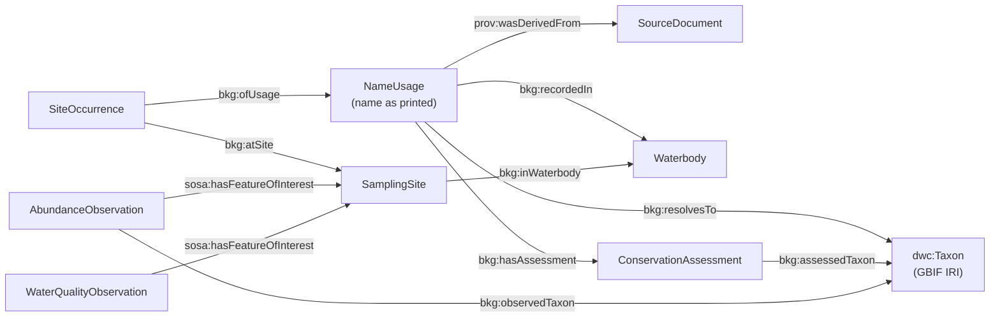

# BioKG Gia Lai

Code and data accompanying the paper *Building a Biodiversity Knowledge Graph from Checklist Tables in Vietnamese Survey Literature* (submitted to ACIIDS 2027).

The pipeline extracts species checklists from Vietnamese survey documents (DOCX, PDF, DOC), reconciles the scientific names against the GBIF Backbone Taxonomy, and loads the result into an RDF knowledge graph. It was tested on 10 documents about four waterbodies in Gia Lai Province, Vietnam: Ayun Ha Reservoir, Ialy Reservoir, the Se San River and Bien Ho Lake.

## What reviewers can check here

| Item | Location |
|---|---|
| Knowledge graph (Turtle, 84,695 triples) | `extracted/gialai/gialai_biokg.ttl` |
| Extracted checklists, site presence/absence, sites, plankton abundance, water quality (CSV) | `extracted/gialai/*.csv` — columns described in [`docs/data_dictionary.md`](docs/data_dictionary.md) |
| Evaluation against author-reported figures (E1–E7) | `extracted/gialai/eval_*.csv` |
| Baselines and ablations | `extracted/gialai/ablation_*.csv` |
| SPARQL competency queries and their results | `biokg/queries/*.rq`, `extracted/gialai/cq_results/*.csv` |
| Browser-based graph explorer (single HTML file, works offline) | `viewer/kg_explorer_en.html` (English), `viewer/kg_explorer.html` (Vietnamese) |
| Pipeline source code | `biokg/` |

To browse the graph, open `viewer/kg_explorer_en.html` in a web browser. If GitHub Pages is enabled for this repository, the explorer is available at `https://<user>.github.io/<repository>/viewer/`.

## Source documents

The source documents are **not** included in this repository: some are journal or proceedings articles under publisher copyright, and some are unpublished manuscripts or project reports. They are listed in `biokg/sources.py` together with the table locations and the summary figures reported by their authors.

| Code | Waterbody | Group | Source |
|---|---|---|---|
| AH_TVN | Ayun Ha | Phytoplankton | Proceedings, 2022, doi:10.15625/vap.2022.0042 |
| AH_DVN | Ayun Ha | Zooplankton | Proceedings, 2022, doi:10.15625/vap.2022.0027 |
| AH_DVD | Ayun Ha | Zoobenthos | Journal article, 2023 (TC KH&CN, Univ. of Sciences, Hue Univ., 23(2)) |
| AH_CA | Ayun Ha | Fish | Journal article, 2023, doi:10.26459/hueunijns.v132i1a.6966 |
| AH_CTN | Ayun Ha | Aquatic insects | Manuscript, 2023 |
| AH_NL | Ayun Ha | Alien species | Proceedings, 2022, doi:10.15625/vap.2022.0005 |
| SESAN_CA | Se San | Fish | Accepted manuscript, 2026 |
| IALY_CA | Ialy | Fish | Proceedings, 2026 (DOI printed: 10.15625/vap.2026.0083) |
| BH_DVD | Bien Ho | Zoobenthos | Proceedings, 2026 (DOI printed: 10.15625/vap.2026.0082) |
| AH_PL | Ayun Ha | Plankton abundance, water quality | Provincial project appendix, 2022 |

## Reproducing the results

Requirements: Python ≥ 3.11 and the packages in `requirements.txt`.

```bash
pip install -r requirements.txt
```

**Steps that run from the files in this repository** (no source documents needed):

```bash
python -m biokg.evaluate        # E1–E7: comparison with author-reported figures -> extracted/gialai/eval_*.csv
python -m biokg.kg              # build gialai_biokg.ttl from the CSV files and run the 8 SPARQL queries
python -m biokg.export_viewer   # rebuild viewer/kg_explorer*.html from the Turtle file
```

**Steps that need the source documents** (place them in `DataSource/` with the file names given in `biokg/sources.py`; `pdftotext` from Poppler must be installed):

```bash
python -m biokg.pipeline        # extraction, name parsing, GBIF resolution -> extracted/gialai/*.csv
python -m biokg.ablation        # baselines and ablations -> extracted/gialai/ablation_*.csv
```

GBIF responses are cached in `extracted/gialai/gbif_cache.json`, so re-running the pipeline gives the same name resolution without network access. Queries not in the cache are sent to `https://api.gbif.org/v1/species/match`.

## Pipeline

| Module | Role |
|---|---|
| `biokg/sources.py` | Per-document configuration: table caption pattern, meaning of conservation columns and symbols, author-reported counts |
| `biokg/extract.py` | Document ingestion, glyph-substitution repair, PDF layout reconstruction from word boxes, record segmentation, site coordinates |
| `biokg/legacy_doc.py` | Text extraction from Word 97 (.doc) files |
| `biokg/names.py` | Parsing of scientific-name strings (canonical name, authorship, morphospecies, symbols) |
| `biokg/resolve.py` | Two-pass GBIF resolution (second pass with family/order/kingdom context) and repair of damaged higher-taxon names |
| `biokg/pipeline.py` | End-to-end run, plankton and water-quality matrices, site merging by coordinates |
| `biokg/evaluate.py` | Evaluation E1–E7 |
| `biokg/ablation.py` | Regular-expression baselines and ablations |
| `biokg/kg.py` | RDF graph construction (Darwin Core, SOSA, PROV-O, SKOS) and SPARQL queries |
| `biokg/export_viewer.py` | Export of the graph to the browser explorer |

## Knowledge graph model



Local terms use the placeholder namespace `https://biokg.example.org/gialai/`; taxon IRIs are GBIF species pages (`https://www.gbif.org/species/<key>`).

## Competency queries

| File | Question |
|---|---|
| `cq1_richness.rq` | How many taxa does each waterbody hold per taxonomic group after name reconciliation? |
| `cq2_shared.rq` | Which species are shared between waterbodies within the same group? |
| `cq3_threatened.rq` | Which taxa are listed as CR, EN or VU, where, and by which document? |
| `cq4_invasive_spread.rq` | Where else are species flagged as alien or invasive in one document recorded? |
| `cq5_toxic_algae_env.rq` | Where and when did toxic cyanobacteria reach their highest densities, and what was the water quality there? |
| `cq6_curation_queue.rq` | Which printed names need expert review, per document and issue type? |
| `cq7_assessment_conflicts.rq` | Which taxa receive different categories under the same scheme in different documents? |
| `cq8_checklist_vs_matrix.rq` | Are all phytoplankton taxa of the published checklist present in the project's abundance matrix? |

## Known limitations

- The name-level reference checklist used for the baseline comparison is the pipeline output after reconciliation with the author-reported figures; it has not yet been verified name by name by a taxonomist. Evaluations E1, E2 and E2b are independent of the pipeline output.
- GBIF synonymies are recorded but not applied automatically; some of them are disputed (see `eval_E4_name_issues.csv`).
- The extraction rules were developed on documents from one research group.
